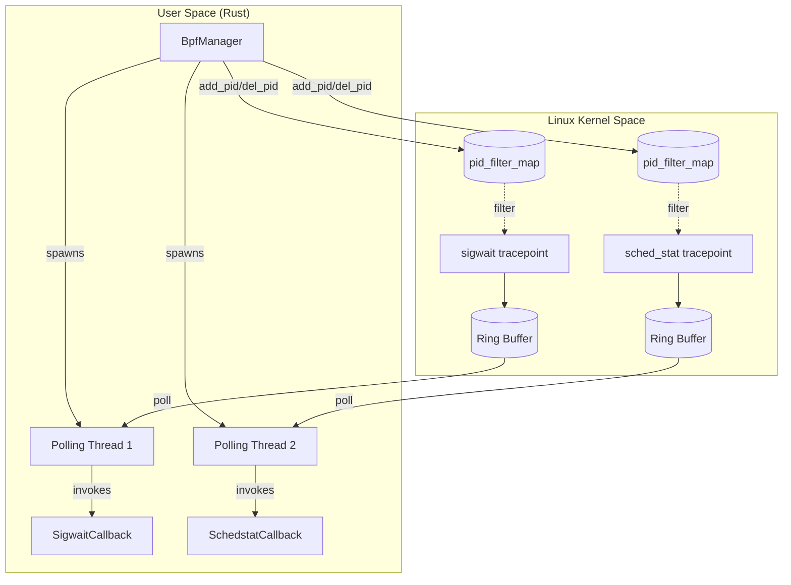
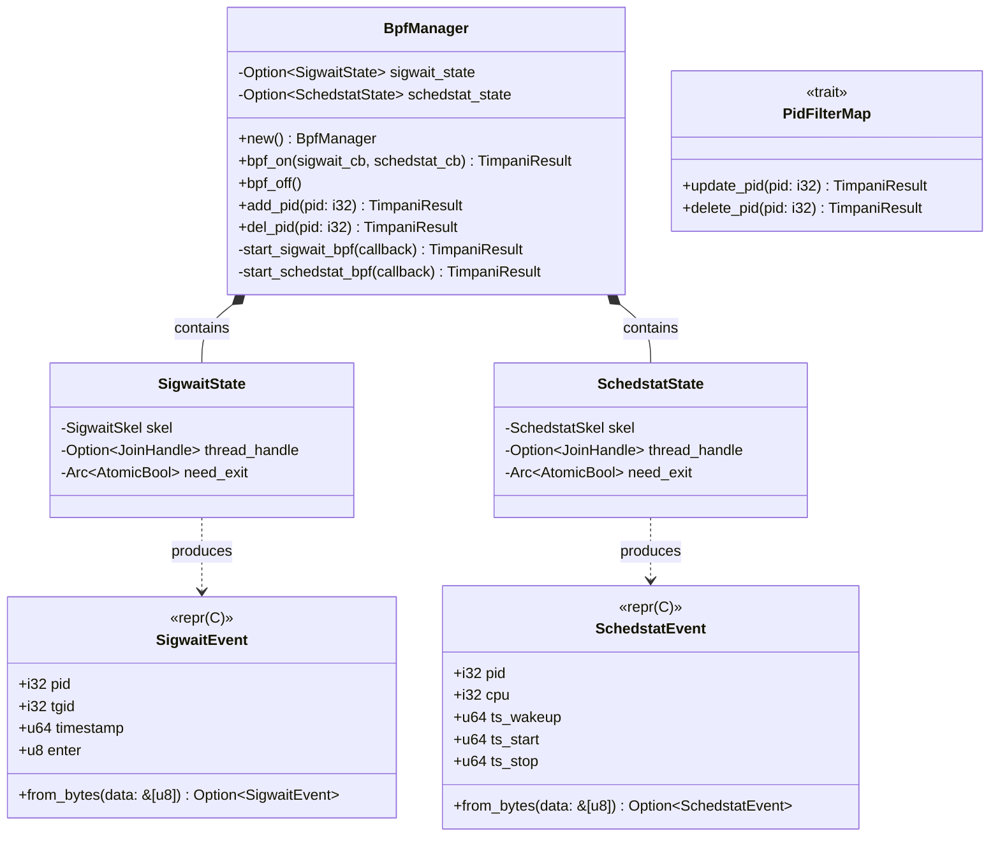
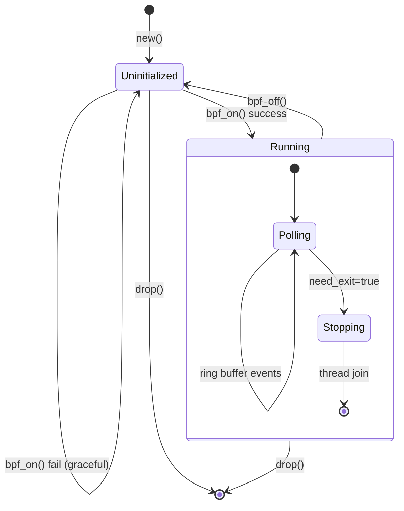
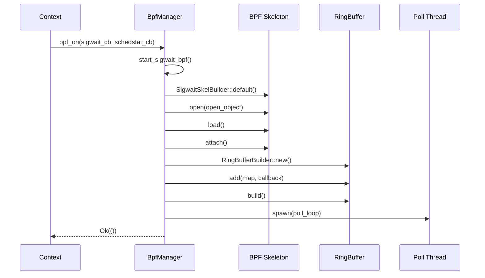
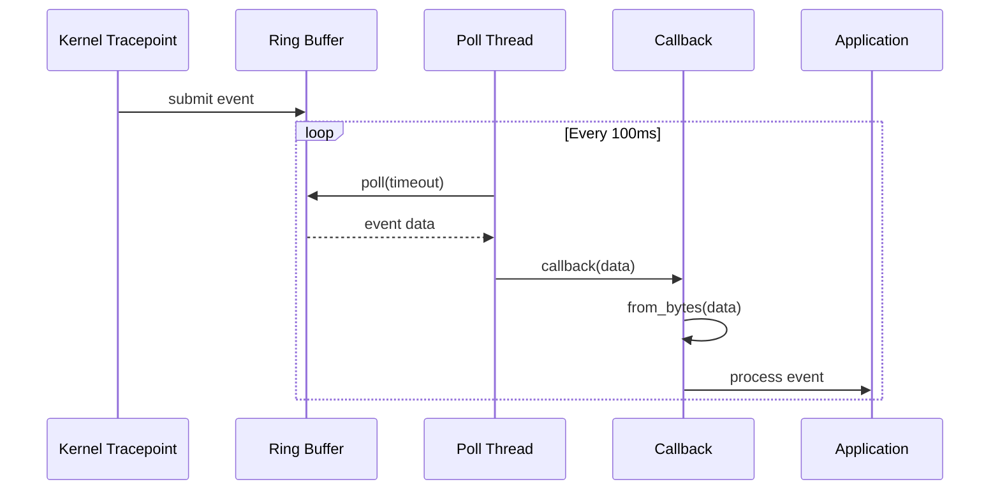
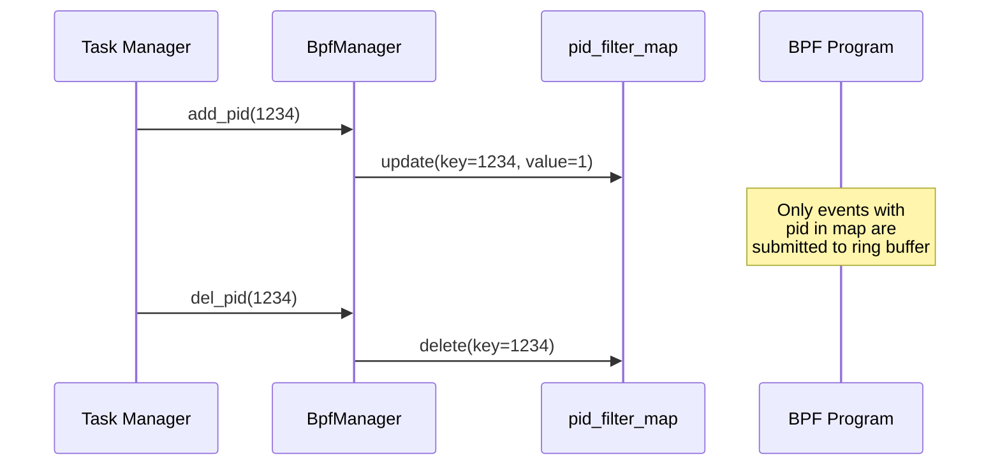
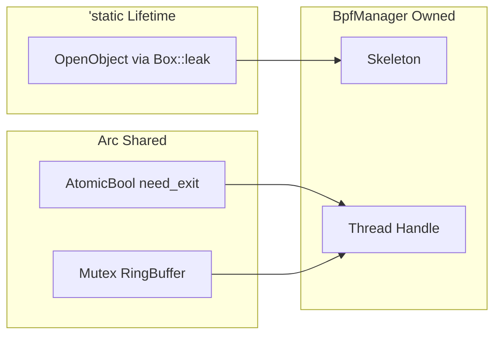

# BPF Subsystem - Low Level Design

## 1. Module Overview

The BPF subsystem provides kernel-level monitoring for real-time task scheduling through eBPF tracepoints. It consists of two core modules:

| Module | Purpose |
|--------|---------|
| `bpf_events.rs` | Event type definitions matching C BPF struct layouts |
| `bpf_manager.rs` | BPF program lifecycle, ring buffer polling, PID filtering |

---

## 2. Architecture



---

## 3. Class Diagram



---

## 4. Event Structures

### 4.1 SigwaitEvent

Captures `sigwait` system call enter/exit events for deadline monitoring.

| Field | Type | Description |
|-------|------|-------------|
| `pid` | i32 | Process ID |
| `tgid` | i32 | Thread Group ID |
| `timestamp` | u64 | Kernel timestamp (ns) |
| `enter` | u8 | 1 = enter, 0 = exit |

**Size**: 24 bytes (with padding)

### 4.2 SchedstatEvent

Captures scheduler statistics for execution time analysis.

| Field | Type | Description |
|-------|------|-------------|
| `pid` | i32 | Process ID |
| `cpu` | i32 | CPU core number |
| `ts_wakeup` | u64 | Wakeup timestamp |
| `ts_start` | u64 | Execution start timestamp |
| `ts_stop` | u64 | Execution stop timestamp |

**Size**: 32 bytes

---

## 5. BpfManager State Machine



---

## 6. Functional Flow

### 6.1 Initialization Sequence



### 6.2 Event Processing



### 6.3 PID Filtering



---

## 7. Feature Flags

| Feature | Effect |
|---------|--------|
| `bpf` (default) | Enables sigwait BPF monitoring |
| `plot` | Enables schedstat BPF monitoring |

Conditional compilation:

```rust
#[cfg(feature = "bpf")]           // sigwait core
#[cfg(all(feature = "bpf", feature = "plot"))]  // schedstat
```

---

## 8. Memory Model



**Key Design Decision**: `Box::leak` creates `'static` lifetime for `OpenObject` required by libbpf-rs skeleton API. Memory is intentionally leaked as BPF runs for program lifetime.

---

## 9. Error Handling

| Scenario | Behavior |
|----------|----------|
| BPF load fails | Log warning, return `Ok(())` (graceful degradation) |
| Ring buffer poll error | Log error, break poll loop |
| PID map update fails | Log warning, return `Ok(())` |
| Schedstat fails but sigwait works | Continue with sigwait only |

---

## 10. Thread Safety

| Component | Protection |
|-----------|------------|
| Ring buffer | `Arc<Mutex<RingBuffer>>` |
| Exit flag | `Arc<AtomicBool>` with `Ordering::Relaxed` |
| Callbacks | `Arc<dyn Fn() + Send + Sync>` |
| PID maps | Protected by BPF map atomic operations |
